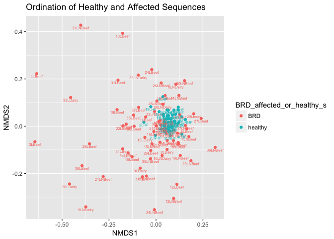

Final Report: BRD causing Bacteria's Affects on the Cattle Industry
================
Katelyn B. Kukar
November 22, 2017

Introduction
============

The cattle industry is one of the world’s most important agricultural enterprises. Cattle breeding and production serves multiple purposes globally for traction, meat, and milk products to be consumed by the human populations within regions of interest. The largest percentage of cattle enterprises come from both North and South America, due to the origin of domestication and societal usages. In North America specifically, society developed cattle drives to bring beef to urban regions and serve the developing western world. In today’s society, these products are still extensively used to meet not only agricultural demands for beef or dairy, but also byproduct consumables for home, health, and industry.

The extensive need for cattle within Northern America is thereby important to economic prosperity, making the wellness of the livestock imperative. Bovine respiratory disease is currently the most devastating disease of the United States cattle population with “annual observed incidences ranging from 5 to 44%” of feedlot calves affected (Snowder et al.). From studies done on these incidences it has been determined that grain treatments for feed calves is directly related to the infection of livestock with BRD, meaning economic prosperity from cattle can negatively affect the livestock itself (Snowder et al.).

In order to determine the economic effects of BRD, Garcia et al. looked at carcass traits to determine how disease changes the quality of meat within affected steers. Those animals treated for BRD have lower quality scores for the meat harvested and a reduction in fat thickness, meaning the diseased cattle had better consumer product worth. Treatment of the animals reduced product quality within the cattle industry (Garcia et al.). From this, the industry has concerning evidence to leave affected animals untreated, in order to prevent a loss in meat quality on high valued cattle reservoirs, and now must forecast how the death of young calves may outweigh the price lost in treatment of the entire stock.

Bovine respiratory disease is caused by the growth of pathogenic bacteria in lung tissue due to stress or viral infection. The syndrome itself arises from multiple factors, which are listed in Lekeu et al. as; age, general condition and immune status, environment, changes in food, temperature and humidity, and the presence of infectious agents (Lekeu et al.). Since, the disease has two potential causes (stress or infection) it leads scientists to test the conditions with which a majority of calves incur the symptoms and the grade of the syndrome that can be treated via vaccination or management practices (Lekeu et al.). BRD is transmitted quickly through cattle stocks via inadequate ventilation from overcrowding and the pathogen alters the animal’s defense mechanism to allow colonization of the lower respiratory tract by bacteria (Fulton et al.). This disease can affect all ages of cattle, but the industry has the highest level of concerns for calves, which have higher rates of mortality from BRD and outbreaks spreading in 60-100% of affected units in tested feedlots, specifically from M. Bovis (Arcangioli et al.).

The cattle industry is incredibly important to the economic prosperity of the United State agricultural industry, with the wellness of young calves has become an increasingly relevant concern for scientists. With the hopes of studying the bacteria associated in lung and mediastinal lymph node tissues of healthy and BRD-diseased calves, microbiologists hope to divulge the microbiome of the lower respiratory tract in order to conclude which bacteria species may be associated with BRD outbreaks alone (Johnston et al.). Here we utilize NGS 16s amplicon analysis to identify the relevant bacteria within animals sampled using Illumnia MiSeq from Johnston et al. We hypothesize that substantial bacterial community differences in the microbiome will arise within healthy and diseased samples. From the diseased samples, we further assume that the bacteria found will have potential relationships to pathogenic disease spreading seen in other livestock species or relationships with the environment, immune responses, or dietary instabilities.

Methods
=======

Study design
------------

Add about half a page here. In this section instead of first person (I/we), use the authors of the paper you selected, since you'll just be describing what they did, based on the methods in their paper.

Sample origin and sequencing
----------------------------

All sample origins and sequencing was done by Johnston et al. and associated authors to obtain the data utilized throughout this analysis.

### Tissue Collection:

38 calves, from a variety of different farms, were selected post-mortem and had cranial lung lobe tissue samples removed, with 32 also having mediastinal lymph node tissues collected. BRD was diagnosed by three independent veterinary laboratories by pathologists through bacterial culture, virological and/or bacteriological PCR and histology for identification. 20 samples of each tissue type were simultaneously collected from control healthy calves. These calves were slaughtered at 2.5 months and had clinical health checks done before slaughter. One gram of lung tissue was extracted from lesions present on the cranial lobe for each sample type (healthy or affected) with 6 immediately frozen at -80 after collection. The remaining samples were placed in RNALater RNA Stabilizing Reagent from Qiagen Inc. and stored based on kit instructions.

### qPCR from Whole Tissue Samples:

DNA extraction of these tissues occurred in a BSLII safety cabinet with Qiagen QIAampe Cador Pathogen Mini Kit after pre-treatments with enzymatic tissue digestion (T2) and for difficult to lyse bacteria (B1). Once treated, a small piece of tissue was homogenized and transferred to a micro centrifuge tube with proteinase K. After nucleic acid was extracted RNA was removed using 5ul RNAase A solution for 100ul of purified samples. DNA was purified using Zymo Genomic DNA Clean and Concentrator -10 Kit. A Nanodrop spechtrophotometer was used to quantify the DNA.

### Library Prep:

One hundred and sixteen 16s rRNA gene amplicon libraries were prepared via PCR amplification of an approximate 467 bp region within the 16sRNA gene in bacteria from 50 ng of each of the extracted and purified DNA samples, using molecular water as a control. This procedure followed guidelines set up by Illumnia 16s meta-genomic sequencing library protocol, with modifications based on sample type. PCR was performed with broad spectrum 16s rRNA primers using Kapa HiFi HotStart 2x ReadyMix DNA polymerase (Kapa Biosystems Ltd., London, UK). Libraries were purified with AMPure XP beads and dual indices and Illumnia sequence adaptors from Illumnia Nextera XT index kits vs B and C were added to target amplicons of interest in a second PCR repeat. A Nanodrop spectrophotometer measured for quality and purity before barcoded amplicon libraries were combined in equal concentrations into a single pool. Two ul of negative control were additionally added. The library pool was quantified with KAPA SYBR FAST universal qPCR kit with Illumnia Primer Premix and size assessment on an Agilent 2100 Bioanalyser. The library was prepped to MiSeq standards and the sequencing run was conducted on the Illumnia MiSeq using the 500 cycle MiSeq reagent kit (v2) with paired 250 bp reads. The data was submitted as a BigProject to NCBI under accession number SRP080306.

Computational
-------------

All computational analyses were conducted by students at the University of San Francisco and Naupaka Zimmerman on data received from Johnston et al. This sequencing data was evaluated individually for quality and hypotheses were furthered through statistical analyses to determine more information about the microbiome of BRD affected and healthy calves.

The packages required for analysis include: dplyr, tidyr, knitr, ggplot2, dada2, seqinr, mctoolsr, phyloseq, and RcolorBrewer. These can be downloaded through R our through their corresponding web links: <https://benjjneb.github.io/dada2/dada-installation.html> for dada2 to clean and analyze data, <https://github.com/leffj/mctoolsr> for mctoolsr.

The BioProject, found under the listed NCBI accession number, needs to have the SRA table initially downloaded using the appropriate Toolkit. A script needs to be run to download the table and also extrapolate all run data from the table as fastaq files with associated quality scores. A fastq dump also is run with a splitting file code to split the forward and reverse reads into forward reads only to be analyzed within a dada pipeline as needed fast files.

The pipeline directly followed is DADA2 with information at <https://benjjneb.github.io/dada2/tutorial.html>. First the path for the data needs to be established with all fastq file sorted by the indicated run number for all samples. Once sorted graphs of the quality scores can be plotted with the plot quality profile function to determine the cut off point for all sequences. The files are filtered and placed into a filtered region of the folder to use in analysis. The sequences are then trimmed following dada pipeline constraints specific to Illumnia MiSeq parameters, which include maximum length required and errors allowed (<https://benjjneb.github.io/dada2/>). A markdown table is produced to see the runs in and out before and after trimming to indicate the level of processing done on each file type. Error models are built to establish a trend of errors within the entirety of the project based on trimming constraints with an expected level of errors to make statistically viable figures; plot errors can visualize these trends. Removal of replicated sequences is an important pipeline quality check to ensure no replications skew data later in the pipeline. Dada is then run on all forward reads with MiSeq parameters to look at homopolymers and potential sequencing deficiencies (<https://benjjneb.github.io/dada2/>) with a post check of the run to evaluate sequences. A site by species matrix is produced to look at the sequence length, coupled with a histogram to see trimming parameters. We see all sequences are trimmed to the same length. Chimeras are removed to aid in the alignment of the sequences and normalize samples. A table can showcase how many sequences are left at each step of the pipeline to track the level of trimming, alignment, and removal of error using the track function within the dada pipeline. Taxonomies are assigned based on documented sequences through the taxa function, and exported as a taxa table for community analysis of known samples. Meta data is merged with taxonomies to bring in all known data about sample origin and sequencing processes from all stages of research on the healthy and affected bovine samples. This information is gathered in a phyloseq object and melted to create a usable data table with known information.

In all resulting statistical analyses the phyloseq object and melted object are applied to use ggplot2 in making tables and figures. The pruning function removes Not Applicable data in some cases.

Results
=======

``` r
library("dplyr")
```

    ## 
    ## Attaching package: 'dplyr'

    ## The following objects are masked from 'package:stats':
    ## 
    ##     filter, lag

    ## The following objects are masked from 'package:base':
    ## 
    ##     intersect, setdiff, setequal, union

``` r
library("tidyr")
library("knitr")
library("ggplot2")
library("citr")
library("dada2")
```

    ## Loading required package: Rcpp

``` r
library("seqinr")
```

    ## 
    ## Attaching package: 'seqinr'

    ## The following object is masked from 'package:dplyr':
    ## 
    ##     count

``` r
library("mctoolsr")
```

    ## You're using mctoolsr (v.0.1.1.1). Direct inquiries to:
    ## 'https://github.com/leffj/mctoolsr'

``` r
library("phyloseq")
```

    ## 
    ## Attaching package: 'phyloseq'

    ## The following object is masked from 'package:mctoolsr':
    ## 
    ##     plot_ordination

``` r
library("RColorBrewer")
```

``` r
load("output/phyloseq_obj.RData")
```

``` r
# Melt Phyloseq
melted_obj <- psmelt(phyloseq_obj)
```

``` r
# apply pruned data set
pruned_phyloseq <- subset_samples(phyloseq_obj)
```

Subsections are ok in the results section too
---------------------------------------------

Tables of interest
==================

``` r
# Add code chunks as needed for your analyses
# For most analyses, I would recommend splitting the
# intensive computational part into a seperate R script file
# and then just load your libraries and the data object here
# using the `load()` function. Ask me for clarification if this is
# unclear.
```

**Figure 1:**

``` r
melted_obj %>%
  ggplot(
       aes(x = BRD_affected_or_healthy_s,
           y = Abundance)) +
  geom_boxplot(alpha = 1) +
  ggtitle("Abundance for Healthy vs. Diseased Calves") +
  xlab("Disease Status") +
  ylab("Abundance") +
  theme_light() +
  scale_y_log10()
```

    ## Warning: Transformation introduced infinite values in continuous y-axis

    ## Warning: Removed 1936163 rows containing non-finite values (stat_boxplot).


Figure 1 represents the abundance of bacteria found within the healthy or BRD affected calves post-mortem for both tissue types sampled. From this figure we can see a similar amount of bacteria was present in both types.

**Figure 2**:

``` r
#abundance, boxplot, table of values
plot_richness(pruned_phyloseq,
              x = "BRD_affected_or_healthy_s",
              measures = c("Observed")) +
 xlab("Sample origin") +
 geom_boxplot(width = 0.2) +
 theme_bw() +
 labs(title = "Healthy vs. Affected Richness Metric")
```

    ## Warning in estimate_richness(physeq, split = TRUE, measures = measures): The data you have provided does not have
    ## any singletons. This is highly suspicious. Results of richness
    ## estimates (for example) are probably unreliable, or wrong, if you have already
    ## trimmed low-abundance taxa from the data.
    ## 
    ## We recommended that you find the un-trimmed data and retry.

 Figure 2 represents the richness of bacterial samples found within healthy and affected calves.

**Figure 3**:

``` r
# alpha diversity metrics
plot_richness(pruned_phyloseq,
              x = "BRD_affected_or_healthy_s",
              measures = c("Shannon")) +
  xlab("Sample origin") +
  geom_boxplot(width = 0.2) +
  theme_bw() +
  labs(title = "Healthy vs. Affected Diversity Metric")
```

    ## Warning in estimate_richness(physeq, split = TRUE, measures = measures): The data you have provided does not have
    ## any singletons. This is highly suspicious. Results of richness
    ## estimates (for example) are probably unreliable, or wrong, if you have already
    ## trimmed low-abundance taxa from the data.
    ## 
    ## We recommended that you find the un-trimmed data and retry.

 Figure 3 outlines a Shannon Diversity Metric to look at the diversity of the samples from healthy and affected calves.

**Figure 4**:

``` r
# Ordination of Healthy and Affected species distribution
set.seed(28)
pruned_ord <- ordinate(pruned_phyloseq, "NMDS", "bray")
```

    ## Square root transformation
    ## Wisconsin double standardization
    ## Run 0 stress 0.2258304 
    ## Run 1 stress 0.2247533 
    ## ... New best solution
    ## ... Procrustes: rmse 0.04258788  max resid 0.3062464 
    ## Run 2 stress 0.237116 
    ## Run 3 stress 0.2328065 
    ## Run 4 stress 0.2375357 
    ## Run 5 stress 0.2285651 
    ## Run 6 stress 0.2304671 
    ## Run 7 stress 0.2319744 
    ## Run 8 stress 0.2321793 
    ## Run 9 stress 0.2248256 
    ## ... Procrustes: rmse 0.03352167  max resid 0.2183311 
    ## Run 10 stress 0.2326097 
    ## Run 11 stress 0.2279355 
    ## Run 12 stress 0.2235778 
    ## ... New best solution
    ## ... Procrustes: rmse 0.03764473  max resid 0.225453 
    ## Run 13 stress 0.2332732 
    ## Run 14 stress 0.2259126 
    ## Run 15 stress 0.2246202 
    ## Run 16 stress 0.2301137 
    ## Run 17 stress 0.2231816 
    ## ... New best solution
    ## ... Procrustes: rmse 0.02547671  max resid 0.1472989 
    ## Run 18 stress 0.2335904 
    ## Run 19 stress 0.2308929 
    ## Run 20 stress 0.2233628 
    ## ... Procrustes: rmse 0.02779466  max resid 0.220512 
    ## *** No convergence -- monoMDS stopping criteria:
    ##     20: stress ratio > sratmax

    ## Warning in postMDS(out$points, dis, plot = max(0, plot - 1), ...): skipping
    ## half-change scaling: too few points below threshold

``` r
# plot ordination without NA
p1 <- plot_ordination(pruned_phyloseq,
                     pruned_ord,
                     type = "samples",
                     color = "BRD_affected_or_healthy_s",
                     title = "Ordination of Healthy and Affected Sequences")
                     print(p1)
```



Figure 4: The observed Ordination, which distinguishes healthy and BRD affected calves, shows a level of relatedness for the healthy calf microbiome, but a large spread within affected calf microbiome.

**Table**:

``` r
# Table to look at Phylums 
melted_obj %>%
  filter(!is.na(Phylum)) %>%
  group_by(BRD_affected_or_healthy_s, Phylum) %>%
  tally() %>%
  spread(key = BRD_affected_or_healthy_s,
         value = n) %>%
  arrange(desc(BRD), desc(healthy)) %>%
  kable()
```

| Phylum                         |      BRD|                                                                                                                           healthy|
|:-------------------------------|--------:|---------------------------------------------------------------------------------------------------------------------------------:|
| Firmicutes                     |    59710|                                                                                                                             34120|
| Bacteroidetes                  |    47740|                                                                                                                             27280|
| Proteobacteria                 |    25060|                                                                                                                             14320|
| Actinobacteria                 |     7070|                                                                                                                              4040|
| Fusobacteria                   |     4550|                                                                                                                              2600|
| Crenarchaeota                  |     2870|                                                                                                                              1640|
| Spirochaetes                   |     2800|                                                                                                                              1600|
| Tenericutes                    |     2590|                                                                                                                              1480|
| Fibrobacteres                  |     1820|                                                                                                                              1040|
| Candidatus\_Saccharibacteria   |     1680|                                                                                                                               960|
| Parcubacteria                  |     1400|                                                                                                                               800|
| Verrucomicrobia                |     1400|                                                                                                                               800|
| Planctomycetes                 |      980|                                                                                                                               560|
| Euryarchaeota                  |      630|                                                                                                                               360|
| Elusimicrobia                  |      560|                                                                                                                               320|
| Synergistetes                  |      280|                                                                                                                               160|
| Cyanobacteria/Chloroplast      |      210|                                                                                                                               120|
| Acidobacteria                  |      140|                                                                                                                                80|
| Chlamydiae                     |      140|                                                                                                                                80|
| Deinococcus-Thermus            |      140|                                                                                                                                80|
| SR1                            |      140|                                                                                                                                80|
| Lentisphaerae                  |       70|                                                                                                                                40|
| Figure 5 looks at the distribu |  tion of|  Phylums throughout the samples tested to see the different types of bacteria represented in the respiratory tract of the calves.|

**Table:**

``` r
# want a table to look att he number of times a certain genus occurs in both healthy and affected individuals
melted_obj %>%
  filter(!is.na(Genus)) %>%
  group_by(BRD_affected_or_healthy_s, Genus) %>%
  tally() %>%
  spread(key = BRD_affected_or_healthy_s,
         value = n) %>%
  arrange(desc(BRD), desc(healthy)) %>%
  head(5) %>%
  kable()
```

| Genus            |    BRD|  healthy|
|:-----------------|------:|--------:|
| Prevotella       |  22260|    12720|
| Bacteroides      |   3150|     1800|
| Succiniclasticum |   2590|     1480|
| Paraprevotella   |   2310|     1320|
| Treponema        |   2170|     1240|

In addition to a minimum of 5-10 figures/tables (and associated captions), you should include sufficient text in this section to describe what your findings were. Remember that in the results section you just describe what you found, but you don't interpret it - that happens in the discussion. 2-3 pages.

Discussion
==========

Add around 3-4 pages interpreting your results and considering future directions one might take in analyzing these data.

Sources Cited
=============
